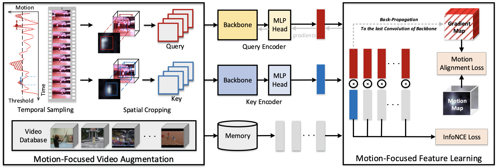

## Motion-Focused Contrastive Learning of Video Representations


### Introduction

This is the code for the paper "**Motion-Focused Contrastive Learning of Video Representations**" (ICCV'21).




### Requirements


* torch == 1.5.1

* torchvision == 0.6.1

* liblinear

* joblib


### Data Preparation

You can refer to [data_prepare](dataset/data_prepare.md)


### MCL Pretraining and Linear Evaluation

This implementation only supports **multi-gpu**, **DistributedDataParallel** training, which is faster and simpler; single-gpu or DataParallel training is not supported.

Following [SeCo](https://arxiv.org/abs/2008.00975), try to download the weights [MoCo v2 (200epochs)](https://dl.fbaipublicfiles.com/moco/moco_checkpoints/moco_v2_200ep/moco_v2_200ep_pretrain.pth.tar) and put it into the **pretrain** folder, and run:

* for UCF101 pretraining and linear evaluation
    ```bash
    bash main_ucf101.sh
    ```
* for Kinetics400 pretraining and linear evaluation
    ```bash
    bash main_kinetics.sh
    ```

The checkpoint will be saved in the `output/checkpoints` entry defined in the configuration file. Besides, the linear evaluation result can be found in `output/eval_output_linear`.


### Downstream task evaluation

* finetune for UCF101
    ```bash
    cd evaluate/downstream_finetune
    bash run_ucf101.sh
    ```

* finetune for HMDB51
    ```bash
    cd evaluate/downstream_finetune
    bash run_hmdb51.sh
    ```
The finetune result can be found in `output/eval_output_finetune`
